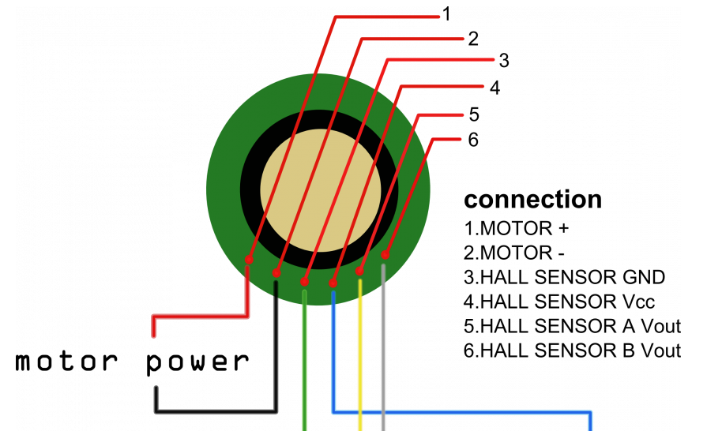

# Micro-controllers

So as of now we had to edit some of the motor control libraries so the PID can run straight from the arduino, but that maight change depending on performance and other factors as of now

* reset button needs to be pressed everytime new code is uploaded
# Current Micro Controllers
**Pin Maps**

* Arduino Due

  * Motor Sheild 1

	```
	_M1INA = 52
	_M1INB = 53
	_M1EN = 22
	_CS1 = A0
	_M2INA = 50
	_M2INB = 51
	_M2EN = 23
	_CS2 = A1
	_PWM1 = 2
	_PWM2 = 3
	```
 * Motor Sheild 2

	```
	_M3INA = 48
	_M3INB = 49
	_M3EN = 24
	_CS3 = A2
	_M4INA = 46
	_M4INB = 47
	_M4EN  = 25
	_CS4 = A3
	_PWM3 = 4
	_PWM4 = 5
	```
 * Encoded Motors
 


```
Wheel 1 = 30
Wheel 2 = A4
Wheel 3 = NOT DECIDED
Wheel 4 = NOT DECIDED
```

* Arduino Mega

